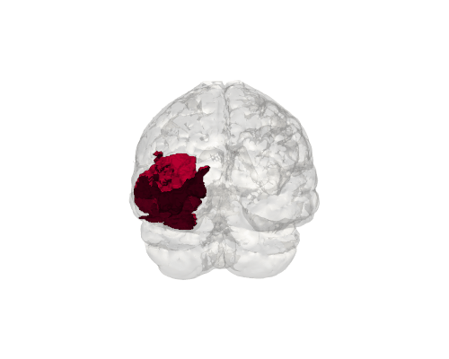
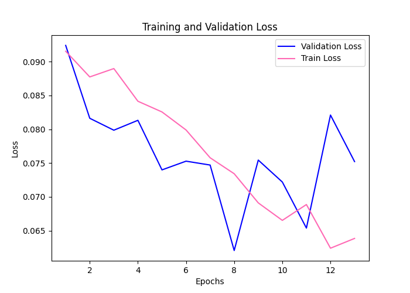
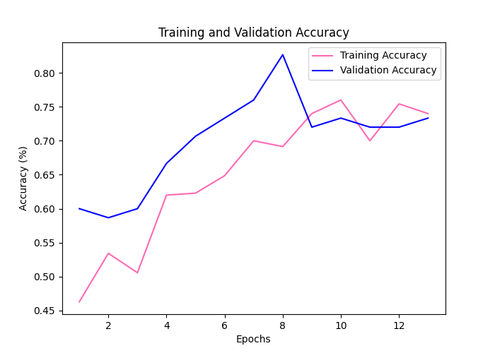
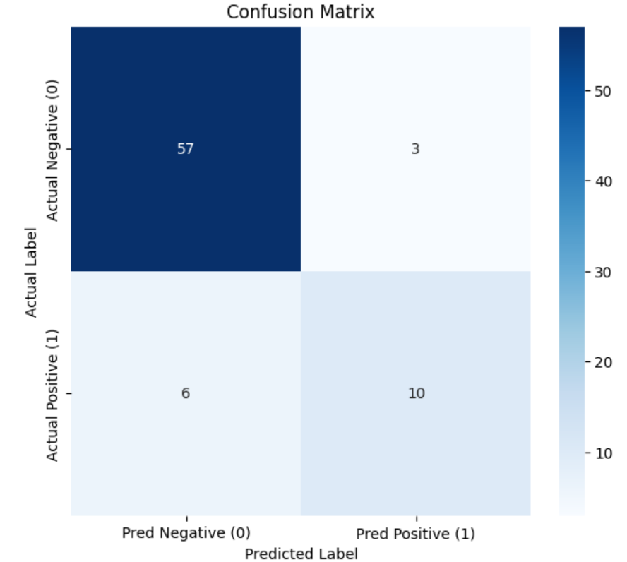
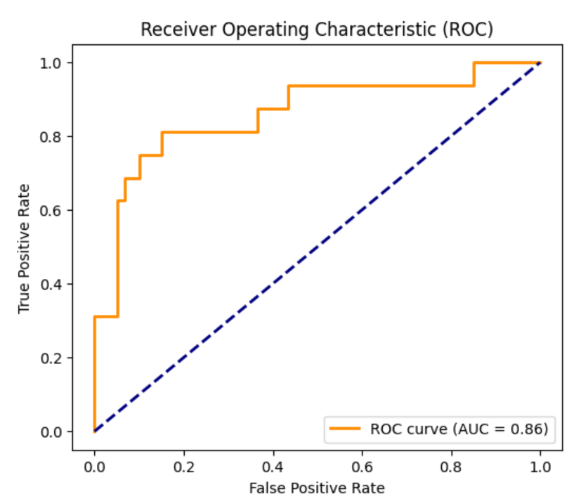
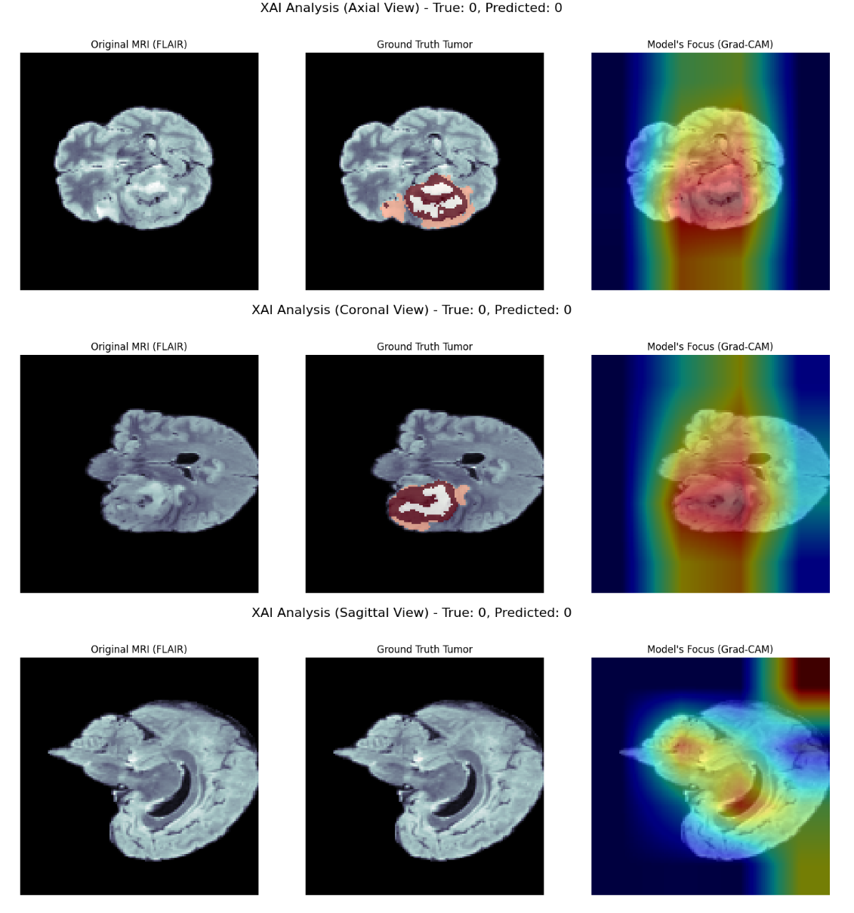

# Explainable Radiogenomics for IDH Mutation Prediction on Low-Memory GPUs

This project leverages 3D deep learning to predict Isocitrate Dehydrogenase (IDH) mutation status in glioma patients from multi-modal MRI scans. A key focus is on achieving high performance while maintaining computational efficiency for deployment on GPUs with limited memory. Furthermore, the project emphasizes model interpretability by using Explainable AI (XAI) techniques to visualize the regions of interest the model uses for its predictions.

-----

## 📋 Table of Contents

1.  [Overview](https://www.google.com/search?q=%23-overview)
2.  [Key Features](https://www.google.com/search?q=%23-key-features)
3.  [Methodology](https://www.google.com/search?q=%23-methodology)
4.  [Performance Results](https://www.google.com/search?q=%23-performance-results)
5.  [Explainable AI (XAI)](https://www.google.com/search?q=%23-explainable-ai-xai)
6.  [Setup and Usage](https://www.google.com/search?q=%23-setup-and-usage)
7.  [Technologies Used](https://www.google.com/search?q=%23-technologies-used)

-----

## 📌 Overview

Radiogenomics is an emerging field that aims to link medical imaging features with underlying genomic characteristics of tumors. IDH mutation is a critical biomarker in gliomas, as it has significant prognostic and therapeutic implications. This project develops a 3D EfficientNet-B7 model, adapted for multi-modal MRI data, to perform this predictive task. By employing a fine-tuning strategy that freezes the majority of the network, the model can be trained effectively on consumer-grade GPUs. Explainability is achieved using Grad-CAM to ensure the model's decisions are transparent and clinically relevant.

-----

## ✨ Key Features

  - **3D Deep Learning**: Utilizes a 3D-adapted EfficientNet-B7 model to capture complex spatial features from volumetric MRI data.
  - **Multi-Modal Data Fusion**: Integrates four MRI sequences (FLAIR, T1, T1c, T2) as input channels to provide a comprehensive view of the tumor.
  - **Low-Memory Fine-Tuning**: Employs a layer-freezing strategy to drastically reduce the number of trainable parameters, enabling training on GPUs with limited VRAM.
  - **Class Imbalance Handling**: Addresses the dataset's natural imbalance using Focal Loss and a `WeightedRandomSampler` for robust training.
  - **Advanced Data Augmentation**: Leverages the `Torchio` library for a rich pipeline of 3D-specific augmentations to improve model generalization.
  - **Explainable AI (XAI)**: Implements Grad-CAM to generate heatmaps that visualize the brain regions the model focuses on for prediction.

-----

## 🔬 Methodology

The project workflow is broken down into the following key stages:

1.  **Data Preparation**: Metadata is loaded to map patient IDs to their IDH mutation status. The labels are converted to a binary format (`0` for Wildtype, `1` for Mutated). The dataset is then stratified and split into 70% training, 15% validation, and 15% testing sets.

2.  **Preprocessing & Augmentation**:

      - All MRI scans are resampled to a uniform size (`128x128x128`) to ensure consistency.
      - The training data undergoes extensive 3D augmentation (flips, affine transforms, elastic deformations) using `Torchio`.
      - A `WeightedRandomSampler` is used in the `DataLoader` to oversample the minority class during training.

3.  **Model Architecture**:

      - A `timm_3d` implementation of **EfficientNet-B7**, pre-trained on a large-scale dataset, is used as the base architecture.
      - The model's input layer is adapted to accept 4 channels (for the four MRI modalities), and the final classifier is set to 2 output classes.

4.  **Low-Memory Training Strategy**:

      - To reduce computational load, all layers of the pre-trained model are initially frozen.
      - Only the final two convolutional blocks and the classifier head are unfrozen, allowing them to be fine-tuned for the specific task of IDH prediction. This significantly reduces the number of trainable parameters.

5.  **Training Loop**:

      - The model is trained using **Focal Loss** to better handle class imbalance and the **AdamW** optimizer.
      - A **OneCycleLR** scheduler dynamically adjusts the learning rate to improve convergence.
      - The training process includes checkpointing and an **early stopping** mechanism to prevent overfitting.

6.  **Evaluation & Visualization**:

      - The model's final performance is evaluated on the held-out test set using metrics like Accuracy, F1-Score, Precision, Recall, and ROC-AUC.
      - A comprehensive suite of plots, including a confusion matrix and ROC curve, are generated to visualize performance.

-----

## 📈 Performance Results

The model's performance was tracked during training and validated on the test set.

#### Training History

The training and validation loss curves show good convergence, with the model learning effectively without significant overfitting. The accuracy curves demonstrate a steady improvement over epochs.

#### Final Test Set Evaluation

The model was ultimately evaluated on the unseen test set, providing an unbiased assessment of its generalization capability.

-----

## 💡 Explainable AI (XAI)

To ensure the model is not just a "black box", **Grad-CAM** was used to highlight the regions of the MRI that were most influential in its predictions. The results clearly show that the model's focus (heatmap) consistently localizes to the area of the tumor (ground truth segmentation), confirming that it has learned clinically relevant features.

-----

## 🛠️ Technologies Used

  - **Python 3.9+**
  - **PyTorch**: Core deep learning framework.
  - **MONAI**: For medical imaging-specific deep learning utilities.
  - **Torchio**: For 3D data loading, preprocessing, and augmentation.
  - **timm\_3d**: For 3D-adapted pre-trained models.
  - **Scikit-learn**: For performance metrics and data splitting.
  - **Pandas & NumPy**: For data manipulation.
  - **Matplotlib & Seaborn**: For plotting and visualizations.
  - **PyVista & SimpleITK**: For 3D data handling and rendering.
  - **TorchCAM**: For Grad-CAM implementation.
